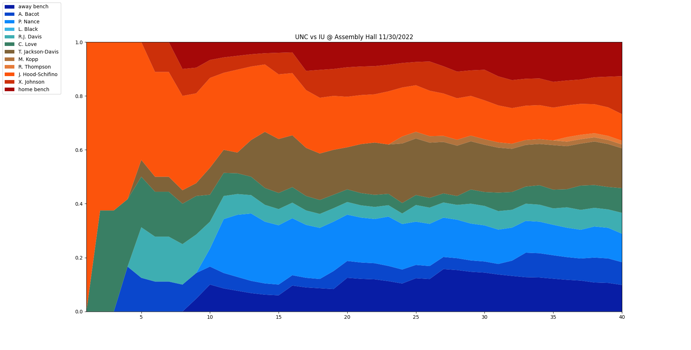

Pull game data from espn for college basketball games and display in a 100% stacked area chart.

All that's needed is the game id which can be found at the end of the espn game url. Given the url "https://www.espn.com/mens-college-basketball/boxscore/_/gameId/401479681", the game id is "401479681".

